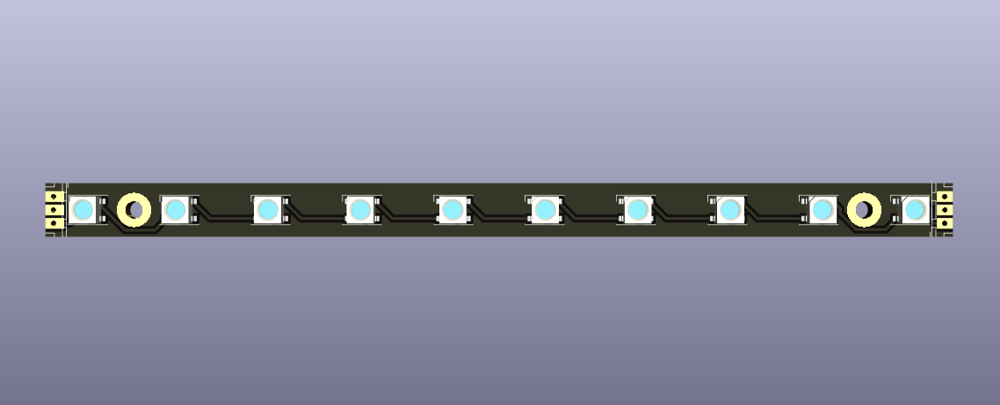

# Tradrack LED stick

This is a mod for Annex Engineering's [TradRack][1] that enables the addition
of LED light indicators for each filament gate/lane.

Since the lanes are spaced at a 17mm pitch, there are no regular LED strips
that would fit a Tradrack with a large number of lanes (I myself use ~35 lanes),
hence the need for this project.

This project is not an official Annex Engineering project and bears no
affiliation with the Annex Engineering organization.  The project is licensed
under the terms of GPL-3.

There are various software options available for controlling these LEDs,
for example by using the [Happy Hare][2] software to control the Tradrack.

For now there's only a PCB design in this repo.  I might eventually add
some 3D-printable parts that aid in mounting the LED boards.

## Fabrication

You can easily get the PCBs fabricated at various PCB shops.  I provide
easy-to-use files for fabrication using [JLCPCB][3] in the `pcb/fabrication-outputs` folder.
Simply upload the files to JLCPCB's assembly service and everything
should mostly just work.

## Mounting

The PCBs are designed with a 17mm pitch which should match the Tradrack lane
spacing.  You can join the PCB with a short piece of wire, a solder bridge,
or a JST-XH straight-through connector.  The PCBs are designed with a 1mm
gap between them to allow for some adjustment when aligning multiple PCBs,
in case the lanes or the PCBs themselves have some imperfections.

**Note**: The LED stick is designed to be adaptable to the [Voron Daylight Disco][4]
pinout.  However, due to space constraints (because the stick needs to maintain the
17mm spacing), there isn't enough room on the board to solder a "normal" or "flipped"
JST-XH connector.  Instead, take a vertical JST-XH connector, and bend the legs 90 degrees
towards the side of the connector housing that has 2 slots.  Then, solder the connector from
above onto the LED stick, letting it hang out over the side of the board.  If done
correctly, the board will be pin-compatible with the Voron Daylight Disco board.

Here are some photos of a finished soldering job for reference:

The PCBs are also designed to be easy to cut at an arbitrary point without
causing a short.  Cutting the PCB between any two LEDs should be easily done
with a hack saw/rotary cutter/...  Just make sure to use appropriate protective
equipment and maybe have a spare stick in case something goes wrong.

### LED profile

I am using a LED profile to mount the LED PCBs into.  The size I'm using is
fairly common in hardware stores, with a 17mm outside width, 6.5mm thick
(without the diffuser), and has a 12mm inner channel.

To mount the PCBs this way, I used thermal double sided tape (to aid with
heat dissipation -- although it shouldn't be strictly needed) and then
the 3D printed mounting bracket in [led-profile-holder](./led-profile-holder).

This assembly can then be mounted at the front of the Trad Rack, in between the 2020
and the cable chain.

It is also necessary to use low-profile M5 bolts for any parts that are mounted to
the front of the Trad Rack extrusion (the `idler_pulley_mount` and `motor_mount_lower`)
if the filament lane modules are mounted in such a way that the corresponding LEDs need
to be in front of these parts. I use [OpenBuilds low profile M5 screws][5], 8mm long.

There won't be any room for other front-mounted parts on the 2020 that stick out more
than 8mm.  For example, you can use [this mount][6] for an ERCF Easy BRD to mount the
board from the bottom of the extrusion instead of the side.

[1]: https://github.com/Annex-Engineering/TradRack
[2]: https://github.com/moggieuk/Happy-Hare/blob/main/doc/leds.md
[3]: https://jlcpcb.com/
[4]: https://github.com/VoronDesign/Voron-Hardware/tree/master/Daylight/Disco_on_a_stick
[5]: https://openbuildspartstore.com/low-profile-screws-m5-10-pack-/
[6]: https://www.printables.com/model/481199-ercf-easybrdcan-brd-mount-for-tr

